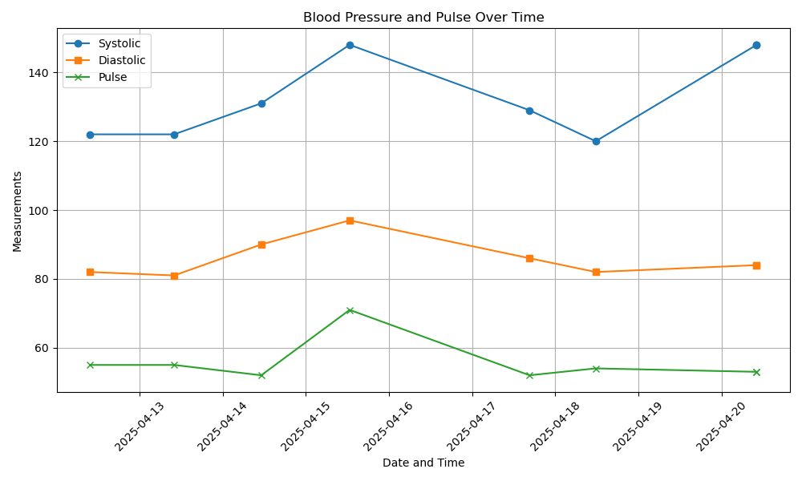

# KA Health Monitor 🩺

This project tracks and visualizes key health indicators — **Systolic**, **Diastolic**, and **Pulse** — using Python and Jupyter Notebook.

## 🚀 Overview

- Parses real-world health readings from a messy CSV format
- Cleans and converts date-time strings into usable `DateTime` objects
- Fixes incorrect data types (e.g., `Pulse` stored as text)
- Plots all three metrics on a single time-based chart for easy trend analysis

## 📊 Features

- Handles custom time format: `%H:%M %d/%m/%Y`
- Cleans and wrangles real-world CSV input
- Unified time-series visualization of multiple health metrics
- Modular and ready for expansion (e.g., moving averages, alerts)

## 🛠 Tools Used

- [Jupyter Notebook](https://jupyter.org/) for iterative analysis
- **Python 3**
- **Pandas** for data manipulation
- **Matplotlib** for visualization

## 📁 Files

- `health_monitor.ipynb` – The main notebook containing all logic and plots
- `ka_daily_health.csv` – Cleaned dataset with timestamps and health readings

## 🔄 What's New in Version 2 (April 2025)

- Cleaned and restructured messy CSV with extra commas
- Parsed `Time` into proper `DateTime` format
- Converted `Diastolic` and `Pulse` from strings to numeric types
- Plotted all three metrics (Systolic, Diastolic, Pulse) on one graph
- Added better layout, labels, and legends for clear interpretation

## 📊 Sample Visualization

## 🧠 Future Enhancements

- Add moving averages for smoothing
- Highlight risky readings (e.g., Systolic > 140)
- Correlate medicine intake with BP readings

---

📌 This project is part of a personal journey into applied data science with real-life, self-recorded health data.

